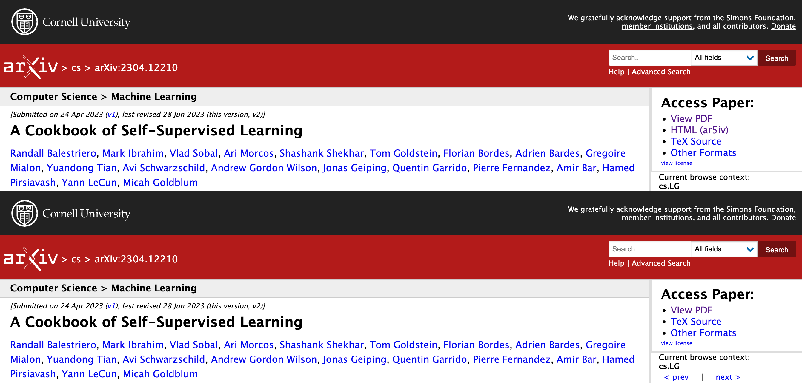

 

# Arxiv Redirector

Arxiv Redirector streamlines your arXiv browsing by auto-redirecting external links to your chosen default view: Abstract, PDF, or HTML. In case the HTML version is not available from arXiv, it will re-direct you to ar5iv automatically.

## Features

* **Automatic Redirection:** Choose your default viewing preference once and let Arxiv Redirector handle the rest.

  
   

* **HTML Fallback:** In cases where the HTML version of a document isn't available on arXiv, Arxiv Redirector automatically redirects you to ar5iv for a seamless browsing experience.

  
   

* **Adds HTML (ar5iv) link to abstract page:** For arxiv papers that don't have an HTML version, Arxiv Redirector adds a link to the ar5iv version of the paper on the abstract page.

  

* **Support for Chrome and Firefox:**  Available for both Google Chrome and Mozilla Firefox browsers.
* **Installation:** Arxiv Redirector can be installed from the Chrome Web Store or Firefox Add-ons page:

## Download

Pick the store link based on your browser:

  

## Install Locally

To install the extension locally, just copy the src-firefox or src-chrome folder to your local machine and follow the relevant instructions below:

1. Chrome Extension local installation:
    * Open the Chrome browser and navigate to `chrome://extensions/`
    * Enable the Developer mode toggle switch in the top right corner
    * Click on the `Load unpacked` button and select the `src-chrome` folder
    * The extension should now be installed and ready to use

2. Firefox Extension local installation:
    * Open the Firefox browser and navigate to `about:debugging#/runtime/this-firefox`
    * Click on the `Load Temporary Add-on` button and select the `manifest.json` file inside the `src-firefox` folder
    * The extension should now be installed and ready to use

## License

This project is licensed under the [MIT License](LICENSE)

## Donate

The project is completely free. Use it as you prefer (download/local install).

If you find it helpful, please consider donating to support the development and maintenance of the extension.

